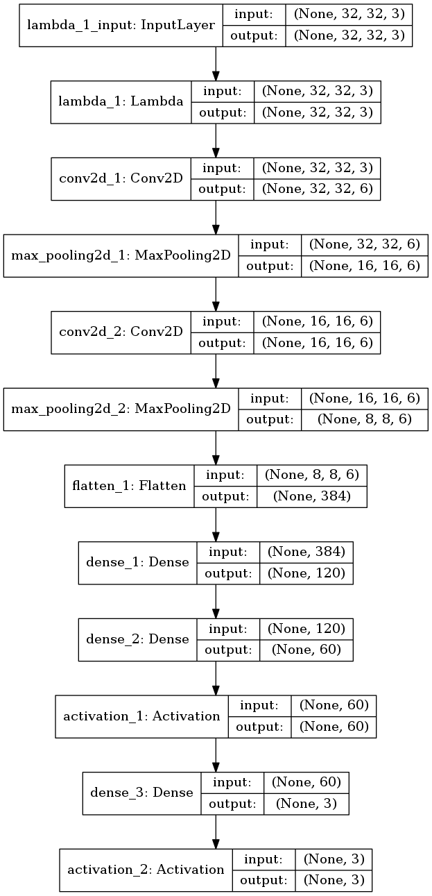

# Traffic Light Classifier

In order to detect the color of the upcoming traffic signals, our strategy consists in first

- Finding a bounding box for the traffic signal
- Find out the state of the signal (RED, YELLOW, GREEN) using a classifier

## Finding bounding box of traffic signal
The [COCO (Common Objects in Context) dataset](http://cocodataset.org/) provides a huge dataset for object detection with many different tags of every day objects. Of interest is their "traffic light" tag, with value 10.

Additionally the Tensorflow library provides with some [pretrained models](https://github.com/tensorflow/models/blob/477ed41e7e4e8a8443bc633846eb01e2182dc68a/object_detection/g3doc/detection_model_zoo.md) on the dataset, and can be used for out-of-the-box inference. We take the 'ssd_mobilenet_v1_coco' model, that is clamied to be the fastest although not the one with most accuracy.

### Input/Output of pretrained model
The output of the pretrained model are as follows:

| NODE NAME         | INPUT/OUTPUT | SHAPE     | DATA DESCRIPTION                                                                                         |
|-------------------|--------------|-----------|----------------------------------------------------------------------------------------------------------|
| image_tensor      | Input        | [1,?,?,3] | RGB pixel values as uint8 in a square format (Width, Height). The first column represent the batch size. |
| detection_boxes   | Output       | [?][4]    | Array of boxes for each detected object in the format [yMin, xMin, yMax, xMax]                           |
| detection_scores  | Output       | [?]       | Array of probability scores for each detected object between 0..1                                        |
| detection_classes | Output       | [?]       | Array of object class indices for each object detected based on COCO objects                             |
| num_detections    | Output       | [1]       | Number of detections                                                                                     |

We are interested in detection_boxes, which will indicate the box for the signal.

### Output filtering and transformation
The output of the infering step is a bounding box that marks the part of the image. We then resize it to 32x32x3 and feed into the classifier.

## Classifier 
The classifier takes as input the previous selected region by the inference process and determines the light color.
### Choosing a simple CNN
Given that there are only three classes to choose from, and there is substantial similarity between the input samples, it makes sense to use a simple CNN for the classification task. As such we use a LeNet style CNN programmed in keras.
This is the graph of the CNN:

#### Training data
Training data is a mixture of labeled data from the BOSCH data set plus images from the simulator. It consists of stretched out images of traffic signals to 32x32 pixels, and we have about 700 features. We train the CNN during 20 epochs and 30% features reserved for validation. Model converges to validation losses of <10E-4 quickly.

